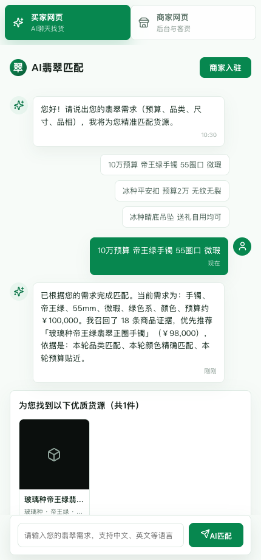
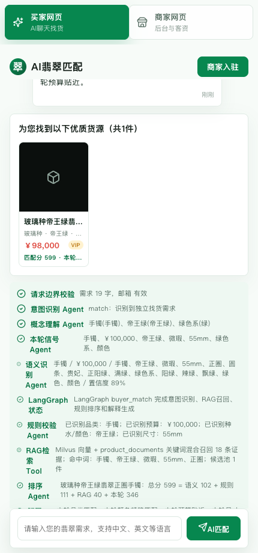
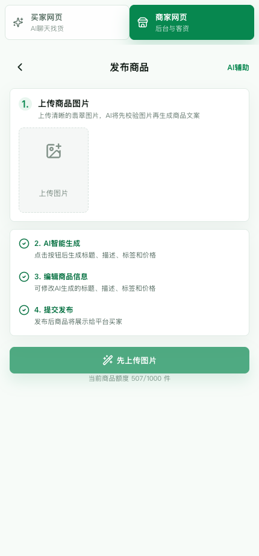
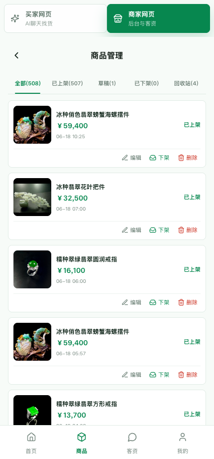
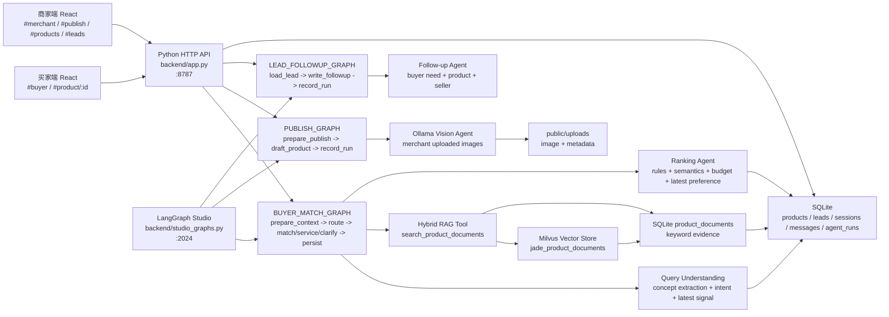
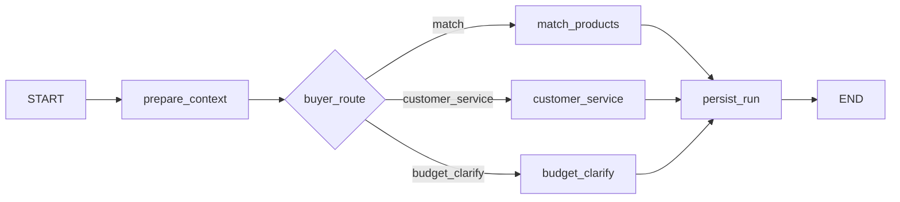

# Jade Agent

[](./README_EN.md)
[](./backend)
[](./src)
[](./langgraph.json)
[](./backend/vector_store.py)
[](./backend/agent.py)

Jade Agent 是一个面向垂直电商的 AI Agent + Agentic RAG 全栈项目。它把翡翠交易里的买家找货、商家图片发布、商品管理和客资跟进做成可运行、可追踪、可本地部署的 Agent 系统。

这个项目适合关注以下方向的开发者：

- AI Agent 应用落地，而不是只做聊天 demo。
- LangGraph 状态机、分支路由、工具调用和运行 trace。
- RAG 检索、商品排序、推荐解释和业务规则协同。
- 本地多模态模型识别商家上传图片，并生成可编辑商品草稿。
- 从前端、后端、数据库、向量库到 Agent 可观测性的完整闭环。

## 快速入口

| 入口 | 内容 |
| --- | --- |
| [架构图](#架构图) | React、Python API、LangGraph、SQLite、Milvus、Ollama 的整体关系 |
| [Agent 架构](#agent-架构) | 买家找货、商家发布、客资跟进三个 LangGraph workflow |
| [产品截图](#产品截图) | 买家匹配、Agent Trace、商家发布、商品管理真实界面 |
| [买家匹配逻辑](#买家匹配逻辑) | 多轮需求理解、RAG 召回、排序和解释 |
| [RAG 数据流](#rag-数据流) | SQLite 商品文档和 Milvus 向量索引如何协同 |
| [运行](#运行) | 本地启动前端、后端、数据库和 Agent 服务 |
| [LangSmith Studio](#langsmith-studio) | 查看 LangGraph 图和执行状态 |

## 产品截图

| 买家 Agent 找货 | Agent 流程 Trace |
| --- | --- |
|  |  |
| 商家图片发布 | 商品运营后台 |
|  |  |

## 为什么值得看

| 常见 Agent 开源能力 | Jade Agent 中的实现 |
| --- | --- |
| Stateful agent | `agent_sessions` 保存多轮找货状态，当前轮偏好会覆盖或细化历史需求 |
| Tool-using agent | 买家 Agent 调用 RAG 检索、库存边界检查、排序、客资写入等工具逻辑 |
| Agentic RAG | Milvus 向量召回 + SQLite 关键词证据 + 业务规则排序，不把 RAG 当成单次问答 |
| Multimodal agent | 商家发布 Agent 读取上传图片，识别品类、颜色、种水、器型、题材和瑕疵描述 |
| Human-editable workflow | AI 生成商品草稿后进入编辑页，由商家复核再发布 |
| Observability | 前端 trace、`agent_runs` 表、`/api/agent/runs` 和 LangSmith Studio 本地图 |

## 核心功能

| 模块 | 功能 |
| --- | --- |
| 买家端 | AI 聊天找货、连续需求细化、商品推荐、商品详情、咨询客资写入 |
| 商家端 | 登录注册、商家首页、商品发布、商品编辑、上下架、删除、回收站、商品列表 |
| 客资端 | 客资列表、客资详情、联系状态、AI 跟进话术 |
| Agent 端 | 买家匹配 Agent、商家发布 Agent、客资跟进 Agent、Milvus 混合 RAG 检索、排序解释、运行 trace |
| 数据层 | SQLite 商品主库、Milvus 向量索引、商品检索文档、会话消息、客资、Agent 运行记录 |
| 可观测 | 前端 trace 面板、`agent_runs` 表、`/api/agent/runs`、LangSmith Studio 本地图视图 |

## 架构图



## Agent 架构

后端使用 Python + LangGraph。核心逻辑在 `backend/agent.py`，Studio 包装图在 `backend/studio_graphs.py`，图声明在 `langgraph.json`。

Jade Agent 的工作方式不是把用户输入直接交给一个大 prompt，而是把一次业务请求拆成可追踪的状态迁移：

1. **理解输入**：把自然语言、上传图片或客资上下文转成结构化状态。
2. **选择路径**：根据状态路由到匹配、客服、澄清、发布草稿或跟进话术。
3. **调用工具**：读取 SQLite 主库、Milvus 向量索引、商品文档、上传图片和商家权限。
4. **执行业务规则**：先做库存、预算、品类、权限等边界校验，再进入召回和排序。
5. **生成输出**：输出推荐、商品草稿或跟进话术，并附带可读解释。
6. **持久化 trace**：把输入、状态、节点输出和运行结果写入 `agent_runs`，方便调试和复盘。

这个设计让 Agent 的每一步都有状态、有证据、有可观测记录，适合继续扩展成更复杂的商品推荐、多商家撮合或人工审核流程。

### 1. 买家找货 Agent

入口：`POST /api/agent/buyer-match`

图：`BUYER_MATCH_GRAPH`



节点职责：

| 节点 | 作用 |
| --- | --- |
| `prepare_context` | 读取或创建会话，写入用户消息，加载上一轮需求，做意图识别、概念理解、本轮信号提取和基础校验 |
| `buyer_route` | 根据意图分流到找货、客服回复或预算澄清 |
| `match_products` | 库存边界检查、查询扩展、RAG 召回、候选过滤、多维排序、生成推荐解释、写入客资 |
| `customer_service` | 处理寒暄、翡翠知识、信息不足但可回答的问题 |
| `budget_clarify` | 预算明显越界时追问，而不是硬推荐 |
| `persist_run` | 写入 assistant 消息、会话状态和 `agent_runs` trace |

买家 Agent 的关键状态：

| 字段 | 含义 |
| --- | --- |
| `need_text` | 本轮用户原文 |
| `session_state.lastParsedNeed` | 上一轮已结构化需求，用于连续细化 |
| `parsed_need` | 当前合并后的找货条件 |
| `latest_signal` | 本轮强信号，例如更贵、更便宜、预算、颜色、品类、场景 |
| `retrieval.documents` | RAG 召回证据 |
| `products` | 排序后的推荐商品 |
| `trace` | 每个 Agent/Tool 的执行说明 |

### 2. 商家发布 Agent

入口：`POST /api/agent/publish`

图：`PUBLISH_GRAPH`


节点职责：

| 节点 | 作用 |
| --- | --- |
| `prepare_publish` | 读取商家、上传图片、商家备注和图片识别结果 |
| `draft_product` | 根据图片识别字段生成商品标题、简介、详情、标签、价格和可编辑草稿 |
| `record_run` | 写入发布 Agent 的运行记录 |

图片策略：

- 图片由商家上传，保存到 `public/uploads`。
- 商品表保存图片 URL，后续商品详情、商品管理、RAG 文档都使用同一批图片字段。
- 当前视觉识别优先使用本地 Ollama 视觉模型，例如 `qwen2.5vl:3b`。
- 视觉 Agent 要求模型返回扁平 JSON，并在后端把英文颜色、对象数组、题材词等非标准输出归一成中文商品字段。
- 视觉识别结果带版本号缓存；当字段 schema 或归一化逻辑升级时，会自动跳过旧缓存重新识别。
- 复杂摆件、俏色雕件会生成更长的视觉 JSON；`empty vision json` 通常表示模型输出被截断或不是可解析 JSON，可通过 `OLLAMA_VISION_NUM_PREDICT` 调整。
- 生成文案面向买家展示，不写内部流程词，例如 RAG、Agent 推荐解释、待商家实测。

### 3. 客资跟进 Agent

入口：`POST /api/agent/leads/:id/followup`

图：`LEAD_FOLLOWUP_GRAPH`


节点职责：

| 节点 | 作用 |
| --- | --- |
| `load_lead` | 校验商家权限，读取客资和关联商品 |
| `write_followup` | 生成买家需求摘要、跟进话术、下一步动作和风险提示 |
| `record_run` | 写入消息和 Agent 运行记录 |

## 买家匹配逻辑

买家匹配不是单次 prompt 生成答案，而是分成四层：

1. **意图识别**：判断本轮是新找货、细化上一轮、客服咨询还是需要追问。
2. **概念理解**：从自然语言里提取预算、品类、颜色、种水、尺寸、瑕疵、证书、用途和价格偏好。
3. **RAG 召回**：用原文和扩展概念查询 Milvus 向量索引和 `product_documents` 关键词文档，拿到商品证据。
4. **排序解释**：结合硬条件、预算贴近度、语义命中、RAG 命中和本轮最新偏好排序，并输出推荐理由。

排序信号：

| 信号 | 说明 |
| --- | --- |
| 品类 | 手镯、吊坠、戒指、项链、摆件等，作为强约束 |
| 预算 | 预算内优先，允许合理贴近；异常低价会进入澄清 |
| 本轮偏好 | “最贵的”“便宜点”“中等价格”“更绿”“送礼”会作为最新一轮信号参与排序 |
| 颜色/种水 | 从商品字段和文档命中共同判断 |
| 尺寸/瑕疵/证书 | 作为规则条件和推荐解释来源 |
| RAG 证据 | 命中 Milvus 向量文档、商品文档、标签、搜索关键词和详情片段 |

## RAG 数据流

每个商品创建或更新时，系统会把商品字段写入 `product_documents`：

- 标题、SKU、价格、品类
- 种水、颜色、器型、尺寸、重量
- 瑕疵、证书、处理方式
- 标签、简介、详情、商家备注

同时系统会为同一份商品文档生成向量，写入 Milvus collection `jade_product_documents`。SQLite 仍然是商品和文档主数据，Milvus 只保存用于召回的向量索引和必要元数据。

买家输入进入匹配流程后：

1. `query_understanding.py` 提取概念和扩展词。
2. `search_product_documents()` 先查 Milvus 向量索引，再查 SQLite `product_documents` 关键词证据。
3. 同一商品的向量得分和关键词得分会合并成 hybrid score。
4. 返回商品 ID、召回来源、向量分、命中词、分数、片段和商品对象。
5. `match_products` 将 RAG 结果和结构化规则合并排序。

RAG 只提供候选和证据，最终推荐仍由排序 Agent 判断；上下架、编辑、删除商品时会同步更新对应商品文档和向量索引。

## 数据库

本地业务数据库：`data/jade-agent.sqlite`

本地向量库默认使用 Milvus Lite：`data/jade-agent-milvus.db`。如果要切到独立 Milvus 服务，把 `MILVUS_URI` 改成服务地址，例如 `http://127.0.0.1:19530`。

| 表 | 用途 |
| --- | --- |
| `sellers` | 商家账号 |
| `seller_sessions` | 商家登录会话 |
| `products` | 商品主表，含图片、状态、价格、详情、标签 |
| `product_documents` | 商品 RAG 检索文档 |
| `leads` | 买家咨询客资 |
| `agent_sessions` | Agent 会话状态 |
| `messages` | 买家和 Agent 消息 |
| `agent_runs` | 每次 Agent 执行的输入、输出、trace、状态 |
| `query_concepts` | 需求理解概念词库 |
| `query_understanding_events` | 每轮需求理解事件 |

| Milvus Collection | 用途 |
| --- | --- |
| `jade_product_documents` | 商品文档向量索引，保存 `product_id`、`chunk_type`、`content`、`category`、`status`、`price` 和向量 |

## 运行

```bash
npm install
python3 -m pip install -r requirements.txt
npm run seed
npm run milvus:sync
npm run dev
```

地址：

| 服务 | 地址 |
| --- | --- |
| 买家端 | `http://127.0.0.1:5173/#buyer` |
| 商家端 | `http://127.0.0.1:5173/#merchant` |
| Python API | `http://127.0.0.1:8787` |
| 健康检查 | `http://127.0.0.1:8787/api/health` |

分开启动：

```bash
npm run dev:api
npm run dev:web
```

本地商家验证码默认是 `123456`，可用 `DEV_OTP_CODE` 覆盖。

## LangSmith Studio

启动 LangGraph Agent Server：

```bash
npm run graph:validate
npm run dev:graph
```

Studio 连接地址：

```text
http://127.0.0.1:2024
```

可选图：

| 图 | 输入 |
| --- | --- |
| `buyer_match` | `need`、`buyerEmail`、`sessionId` |
| `merchant_publish` | `sellerId`、`hint`、`images`、`imageAnalyses` |
| `lead_followup` | `sellerId`、`leadId` |

端口分工：

| 端口 | 用途 |
| --- | --- |
| `5173` | React 前端 |
| `8787` | 业务 API |
| `2024` | LangGraph Studio Agent Server |

## 环境变量

| 变量 | 默认值 | 说明 |
| --- | --- | --- |
| `PORT` | `8787` | Python API 端口 |
| `DEV_OTP_CODE` | `123456` | 本地商家登录验证码 |
| `AI_PROVIDER` | `auto` | 设置为 `ollama` 时允许本地模型参与文本理解 |
| `QUERY_UNDERSTANDING_PROVIDER` | 未设置 | 设置为 `ollama` 可强制需求理解调用 Ollama |
| `OLLAMA_BASE_URL` | `http://127.0.0.1:11434` | Ollama 服务地址 |
| `OLLAMA_MODEL` / `AI_MODEL` | `qwen2.5:7b` | 文本理解模型 |
| `OLLAMA_VISION_MODEL` / `VISION_MODEL` | 自动选择 | 商家发布图片识别模型 |
| `OLLAMA_VISION_TIMEOUT` | `60` | 视觉模型请求超时秒数 |
| `OLLAMA_VISION_NUM_PREDICT` | `320` | 视觉 JSON 最大生成 token 数；复杂图片过低会导致 JSON 截断 |
| `OLLAMA_VISION_KEEP_ALIVE` | `15m` | 视觉模型保活时间 |
| `VECTOR_STORE` | `auto` | `auto` 启用 Milvus 但不阻断主库写入；`milvus` 强制向量库可用；`sqlite`/`off` 只用 SQLite 关键词检索 |
| `MILVUS_URI` | `data/jade-agent-milvus.db` | Milvus Lite 文件或独立 Milvus 服务地址 |
| `MILVUS_COLLECTION` | `jade_product_documents` | 商品文档向量 collection |
| `MILVUS_EMBEDDING_DIM` | `384` | 向量维度 |
| `VECTOR_EMBEDDING_PROVIDER` | `hash` | 默认本地确定性 embedding；可设为 `ollama` 调用 Ollama embedding |
| `OLLAMA_EMBEDDING_MODEL` | `nomic-embed-text` | `VECTOR_EMBEDDING_PROVIDER=ollama` 时使用 |

## 测试

```bash
npm run eval:agents
npm run test:api
npm run test:e2e
npm test
```
