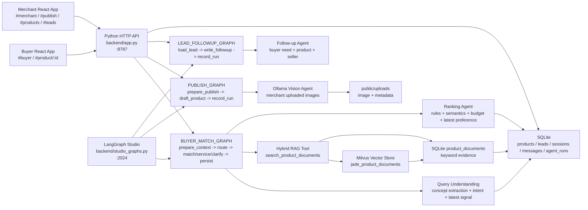
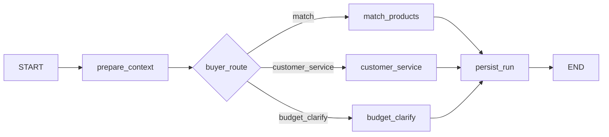

# Jade Agent

[](./README.md)
[](./backend)
[](./src)
[](./langgraph.json)
[](./backend/vector_store.py)
[](./backend/agent.py)

Jade Agent is a full-stack AI Agent + Agentic RAG system for vertical commerce. It turns jadeite sourcing, merchant image publishing, product operations, and lead follow-up into runnable, traceable, locally deployable agent workflows.

This project is useful if you are exploring:

- AI agent applications beyond a chatbot demo.
- LangGraph state machines, routing, tool use, and execution traces.
- RAG retrieval, product ranking, recommendation explanations, and business rules working together.
- Local multimodal models that read merchant-uploaded images and draft editable product listings.
- A complete loop across frontend, API, database, vector search, and agent observability.

## Quick Links

| Link | What it covers |
| --- | --- |
| [Architecture](#architecture) | React, Python API, LangGraph, SQLite, Milvus, and Ollama |
| [Agent Architecture](#agent-architecture) | Buyer sourcing, merchant publishing, and lead follow-up workflows |
| [Buyer Matching Logic](#buyer-matching-logic) | Multi-turn understanding, RAG retrieval, ranking, and explanations |
| [RAG Data Flow](#rag-data-flow) | How SQLite product documents and Milvus vector search work together |
| [Run Locally](#run-locally) | Start the frontend, backend, database, and agent services |
| [LangSmith Studio](#langsmith-studio) | Inspect LangGraph structure and execution state |

## Why This Project

| Open-source agent pattern | Jade Agent implementation |
| --- | --- |
| Stateful agent | `agent_sessions` stores multi-turn sourcing state, and latest-turn preferences refine or override prior needs |
| Tool-using agent | The buyer agent calls RAG retrieval, inventory boundary checks, ranking, and lead creation logic |
| Agentic RAG | Milvus vector retrieval + SQLite keyword evidence + business-rule ranking, not a single RAG answer |
| Multimodal agent | The merchant publishing agent reads uploaded images and extracts category, color, water quality, shape, motifs, and flaw descriptions |
| Human-editable workflow | AI-generated product drafts move into an edit screen before merchant publishing |
| Observability | Frontend trace panel, `agent_runs`, `/api/agent/runs`, and a local LangSmith Studio graph |

## Core Features

| Module | Capability |
| --- | --- |
| Buyer app | AI sourcing chat, multi-turn refinement, product recommendations, product detail, lead creation |
| Merchant app | Login, dashboard, product publishing, editing, listing, delisting, deletion, recycle bin, product list |
| Lead app | Lead list, lead detail, contact status, AI follow-up copy |
| Agent layer | Buyer matching agent, merchant publishing agent, lead follow-up agent, Milvus hybrid RAG retrieval, ranking explanations, run traces |
| Data layer | SQLite source of truth, Milvus vector index, product retrieval documents, sessions, messages, leads, agent runs |
| Observability | Frontend trace panel, `agent_runs`, `/api/agent/runs`, local LangSmith Studio graph view |

## Architecture



## Agent Architecture

The backend uses Python and LangGraph. Core logic lives in `backend/agent.py`, Studio wrapper graphs live in `backend/studio_graphs.py`, and graph exports are declared in `langgraph.json`.

### 1. Buyer Sourcing Agent

Endpoint: `POST /api/agent/buyer-match`

Graph: `BUYER_MATCH_GRAPH`



Node responsibilities:

| Node | Responsibility |
| --- | --- |
| `prepare_context` | Reads or creates a session, stores the user message, loads prior need state, detects intent, understands concepts, extracts latest-turn signals, and validates boundaries |
| `buyer_route` | Routes the turn to matching, customer service, or budget clarification |
| `match_products` | Runs inventory boundary checks, query expansion, RAG retrieval, candidate filtering, multi-signal ranking, recommendation explanation, and lead creation |
| `customer_service` | Handles greetings, jade knowledge, and answerable non-matching questions |
| `budget_clarify` | Asks a follow-up question when the budget is clearly out of range |
| `persist_run` | Stores assistant messages, session state, and `agent_runs` traces |

Key buyer agent state:

| Field | Meaning |
| --- | --- |
| `need_text` | Current user message |
| `session_state.lastParsedNeed` | Prior structured need used for multi-turn refinement |
| `parsed_need` | Current merged sourcing constraints |
| `latest_signal` | Strong current-turn signal, such as premium, cheaper, budget, color, category, or occasion |
| `retrieval.documents` | RAG evidence |
| `products` | Ranked recommendations |
| `trace` | Agent and tool execution details |

### 2. Merchant Publishing Agent

Endpoint: `POST /api/agent/publish`

Graph: `PUBLISH_GRAPH`


Node responsibilities:

| Node | Responsibility |
| --- | --- |
| `prepare_publish` | Reads merchant, uploaded images, merchant notes, and image analysis results |
| `draft_product` | Generates editable product title, intro, detail, tags, price, and fields from image-recognition output |
| `record_run` | Stores the publishing agent run |

Image strategy:

- Merchants upload images to `public/uploads`.
- Product records keep image URLs, and product detail, product management, and RAG documents reuse those fields.
- Vision recognition prefers a local Ollama vision model such as `qwen2.5vl:3b`.
- The vision agent asks the model for flat JSON, then normalizes non-standard output such as English colors, object arrays, and motif terms into Chinese product fields.
- Vision results are versioned in the upload metadata cache; schema or normalization changes skip stale cached analysis and rerun recognition.
- Complex display pieces and multicolor carvings need longer vision JSON. `empty vision json` usually means the model output was truncated or not parseable JSON; tune `OLLAMA_VISION_NUM_PREDICT` if needed.
- Generated copy is buyer-facing and does not expose internal terms such as RAG, agent recommendation explanation, or pending merchant measurement.

### 3. Lead Follow-up Agent

Endpoint: `POST /api/agent/leads/:id/followup`

Graph: `LEAD_FOLLOWUP_GRAPH`


Node responsibilities:

| Node | Responsibility |
| --- | --- |
| `load_lead` | Checks merchant authorization and loads the lead plus related product |
| `write_followup` | Generates buyer summary, follow-up copy, next actions, and risk notes |
| `record_run` | Stores messages and the agent run |

## Buyer Matching Logic

Buyer matching is not a single prompt response. It is split into four layers:

1. **Intent detection**: identifies new sourcing, prior-need refinement, customer-service chat, or clarification needs.
2. **Concept understanding**: extracts budget, category, color, water quality, size, flaws, certificate needs, occasion, and price preference.
3. **RAG retrieval**: queries the Milvus vector index and SQLite `product_documents` keyword documents with the original text and expanded concepts.
4. **Ranking and explanation**: ranks with hard constraints, budget fit, semantic hits, RAG evidence, and latest-turn preference.

Ranking signals:

| Signal | Description |
| --- | --- |
| Category | Bangle, pendant, ring, necklace, ornament, and related product types as strong constraints |
| Budget | In-budget products first, with reasonable near-budget support; clearly invalid low budgets trigger clarification |
| Latest preference | Messages such as "most expensive", "cheaper", "mid price", "greener", and "for gifting" affect current-turn ranking |
| Color / water quality | Compared through structured product fields and document hits |
| Size / flaws / certificate | Used as rule constraints and recommendation explanations |
| RAG evidence | Milvus vector hits, product document hits, tags, search keywords, and detail snippets |

## RAG Data Flow

When a product is created or updated, the system writes product fields into `product_documents`:

- title, SKU, price, category
- water quality, color, shape, size, weight
- flaws, certificate, treatment
- tags, intro, detail, merchant notes

The same product document is embedded and written into the Milvus collection `jade_product_documents`. SQLite remains the source of truth for products and document text; Milvus stores the vector index and required retrieval metadata.

When a buyer message enters the matching flow:

1. `query_understanding.py` extracts concepts and expansion terms.
2. `search_product_documents()` searches Milvus first, then SQLite `product_documents` keyword evidence.
3. Vector score and keyword score for the same product are merged into a hybrid score.
4. Retrieval returns product ID, retrieval source, vector score, matched terms, score, snippet, and product payload.
5. `match_products` merges RAG results with structured rules for final ranking.

RAG provides candidates and evidence. The ranking agent decides the final recommendations. Product listing, delisting, editing, and deletion update the product document and vector index together.

## Database

Local business database: `data/jade-agent.sqlite`

The local vector database uses Milvus Lite by default: `data/jade-agent-milvus.db`. To use a standalone Milvus service, set `MILVUS_URI` to a service URL such as `http://127.0.0.1:19530`.

| Table | Purpose |
| --- | --- |
| `sellers` | Merchant accounts |
| `seller_sessions` | Merchant login sessions |
| `products` | Product table with images, status, price, detail copy, and tags |
| `product_documents` | RAG retrieval documents |
| `leads` | Buyer inquiry leads |
| `agent_sessions` | Agent session state |
| `messages` | Buyer and agent messages |
| `agent_runs` | Input, output, trace, and status for every agent run |
| `query_concepts` | Query-understanding concept dictionary |
| `query_understanding_events` | Per-turn query understanding events |

| Milvus Collection | Purpose |
| --- | --- |
| `jade_product_documents` | Product document vector index with `product_id`, `chunk_type`, `content`, `category`, `status`, `price`, and vectors |

## API

| Endpoint | Description |
| --- | --- |
| `GET /api/health` | Backend health check |
| `GET /api/app-state` | Frontend bootstrap state |
| `POST /api/auth/otp` | Request merchant login code |
| `POST /api/auth/login` | Merchant login |
| `GET /api/products` | Product list |
| `GET /api/products/:id` | Product detail |
| `POST /api/products` | Create product |
| `PUT /api/products/:id` | Update product |
| `PATCH /api/products/:id/status` | List, delist, draft, or restore product |
| `DELETE /api/products/:id` | Delete product |
| `POST /api/uploads/images` | Upload product images and run vision analysis |
| `GET /api/leads` | Merchant lead list |
| `GET /api/leads/:id` | Lead detail |
| `POST /api/leads/:id/contacted` | Mark lead as contacted |
| `POST /api/agent/buyer-match` | Buyer sourcing agent |
| `POST /api/agent/publish` | Merchant publishing agent |
| `POST /api/agent/leads/:id/followup` | Lead follow-up agent |
| `GET /api/agent/runs` | Agent run records |

## Run Locally

```bash
npm install
python3 -m pip install -r requirements.txt
npm run seed
npm run milvus:sync
npm run dev
```

URLs:

| Service | URL |
| --- | --- |
| Buyer app | `http://127.0.0.1:5173/#buyer` |
| Merchant app | `http://127.0.0.1:5173/#merchant` |
| Python API | `http://127.0.0.1:8787` |
| Health check | `http://127.0.0.1:8787/api/health` |

Run services separately:

```bash
npm run dev:api
npm run dev:web
```

The default local merchant login code is `123456`. Override it with `DEV_OTP_CODE`.

## LangSmith Studio

Start the LangGraph Agent Server:

```bash
npm run graph:validate
npm run dev:graph
```

Studio Base URL:

```text
http://127.0.0.1:2024
```

Available graphs:

| Graph | Input |
| --- | --- |
| `buyer_match` | `need`, `buyerEmail`, `sessionId` |
| `merchant_publish` | `sellerId`, `hint`, `images`, `imageAnalyses` |
| `lead_followup` | `sellerId`, `leadId` |

Ports:

| Port | Purpose |
| --- | --- |
| `5173` | React frontend |
| `8787` | Product API |
| `2024` | LangGraph Studio Agent Server |

## Environment Variables

| Variable | Default | Description |
| --- | --- | --- |
| `PORT` | `8787` | Python API port |
| `DEV_OTP_CODE` | `123456` | Local merchant login code |
| `AI_PROVIDER` | `auto` | Set to `ollama` to allow local text model query understanding |
| `QUERY_UNDERSTANDING_PROVIDER` | unset | Set to `ollama` to force query understanding through Ollama |
| `OLLAMA_BASE_URL` | `http://127.0.0.1:11434` | Ollama service URL |
| `OLLAMA_MODEL` / `AI_MODEL` | `qwen2.5:7b` | Text understanding model |
| `OLLAMA_VISION_MODEL` / `VISION_MODEL` | auto selected | Merchant image recognition model |
| `OLLAMA_VISION_TIMEOUT` | `60` | Vision request timeout in seconds |
| `OLLAMA_VISION_NUM_PREDICT` | `320` | Max generated tokens for vision JSON; too low can truncate complex image output |
| `OLLAMA_VISION_KEEP_ALIVE` | `15m` | Vision model keep-alive |
| `VECTOR_STORE` | `auto` | `auto` enables Milvus without blocking source-of-truth writes; `milvus` requires the vector store; `sqlite`/`off` uses SQLite keyword retrieval only |
| `MILVUS_URI` | `data/jade-agent-milvus.db` | Milvus Lite file or standalone Milvus service URL |
| `MILVUS_COLLECTION` | `jade_product_documents` | Product document vector collection |
| `MILVUS_EMBEDDING_DIM` | `384` | Embedding dimension |
| `VECTOR_EMBEDDING_PROVIDER` | `hash` | Default deterministic local embeddings; set to `ollama` for Ollama embeddings |
| `OLLAMA_EMBEDDING_MODEL` | `nomic-embed-text` | Model used when `VECTOR_EMBEDDING_PROVIDER=ollama` |

## Tests

```bash
npm run eval:agents
npm run test:api
npm run test:e2e
npm test
```

## Project Layout

| Path | Description |
| --- | --- |
| `backend/app.py` | Python API, auth, uploads, products, leads, and agent routes |
| `backend/agent.py` | LangGraph workflows, buyer matching, merchant publishing, and lead follow-up |
| `backend/query_understanding.py` | Query understanding, concept normalization, optional Ollama JSON parsing |
| `backend/db.py` | SQLite schema, seed data, product documents, Milvus sync entry points, run records |
| `backend/vector_store.py` | Milvus client, embeddings, product vector writes, and vector retrieval |
| `backend/studio_graphs.py` | Graph wrappers for LangSmith Studio |
| `backend/validation.py` | API boundary input validation |
| `src/App.jsx` | Frontend entry and page mounting |
| `src/screens/buyer.jsx` | Buyer sourcing chat and product detail |
| `src/screens/merchant.jsx` | Merchant dashboard, publishing, products, leads, account pages |
| `src/routing.jsx` | Hash route parsing |
| `src/api.js` | Frontend API client |
| `src/upload.js` | Image upload handling |
| `src/styles/` | Page styles |
| `tests/test_api.py` | Python API tests |
| `tests/e2e/app-smoke.spec.js` | Playwright smoke tests |
| `data/jade-agent.sqlite` | Local SQLite database |
| `data/jade-agent-milvus.db` | Local Milvus Lite vector database |
| `public/uploads` | Merchant-uploaded images |
